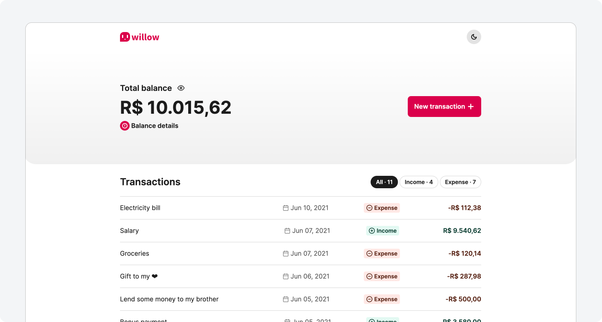
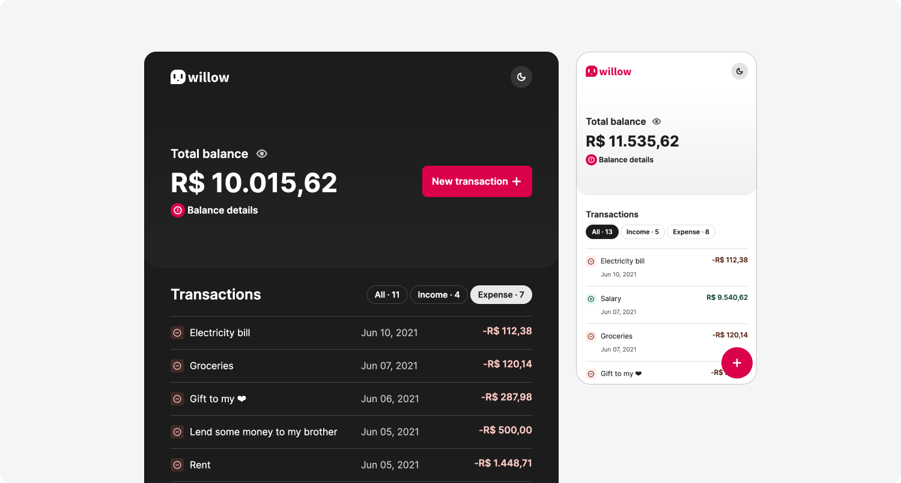
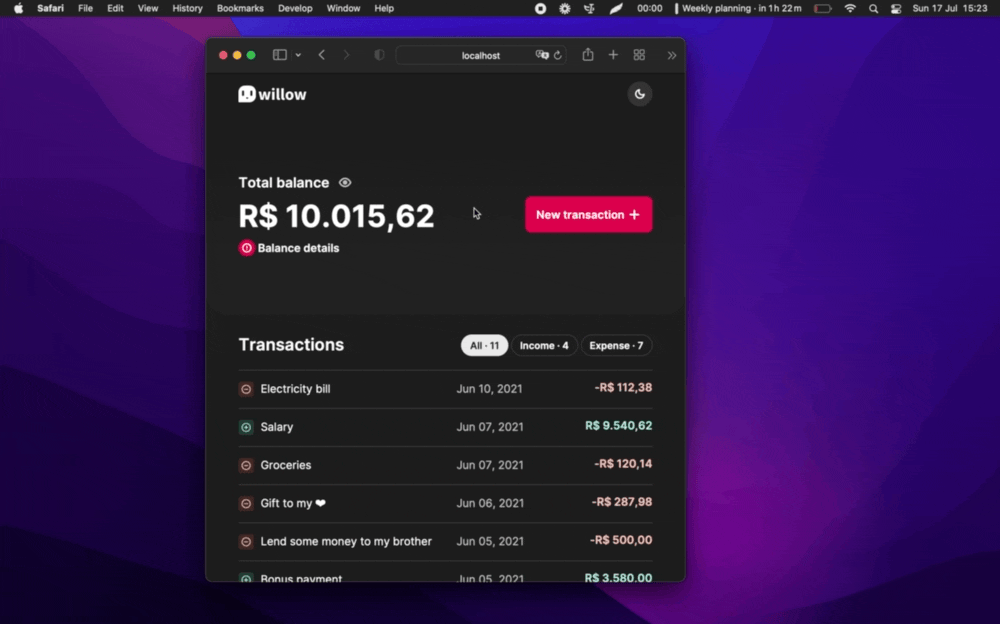
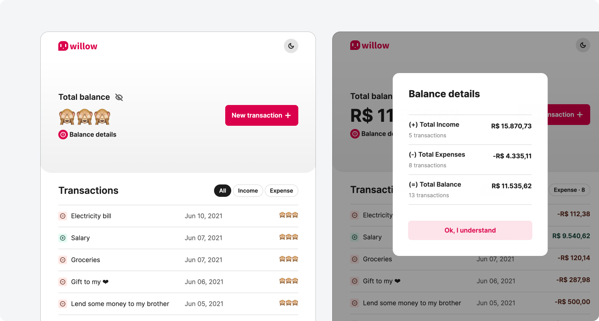

# Willow Personal Finance - Exercise from Warren Tech Academy

Tools:

- HTML
- CSS (SASS)
- JavaScript
- Modular approach using SASS and JavaScript native modules for styling and scripting, respectively

 

Implemented features:

- Adding new transactions via modal component
- Listing and filtering transactions
- Calculating and displaying data summary based on created transactions
- Hide values
- UI theming
- Responsive layout

 

## Project screenshots

 
 
 
 
 

 

## Extra notes

- As an exercise, this project wasn’t focused on advanced optimizations regarding data storage, processing, accessibility, scalability, cross-browser compatibility, etc. There’s still a lot to be done about it.
- The UI was designed for this exercise.
- As most projects, this one is not bug/error-free. If you find any bug or unexpected behavior, feel free to get in touch, here is my email - dfaferreira46@gmail.com
